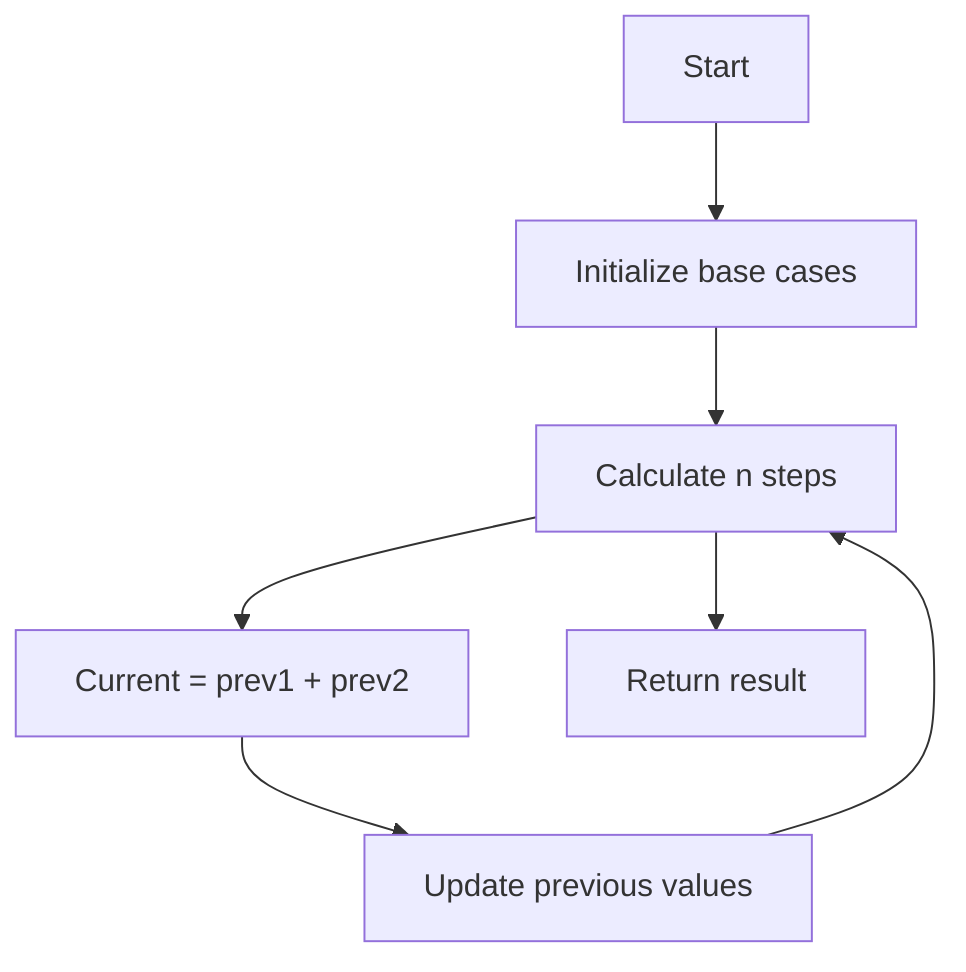
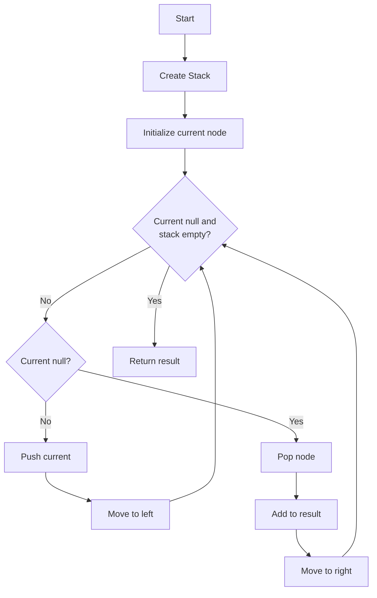
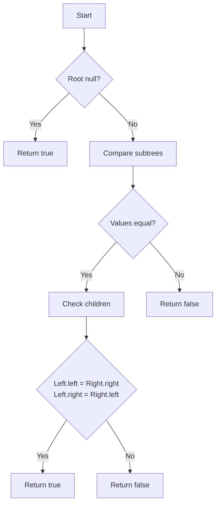
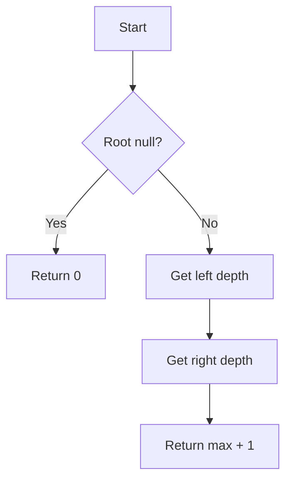
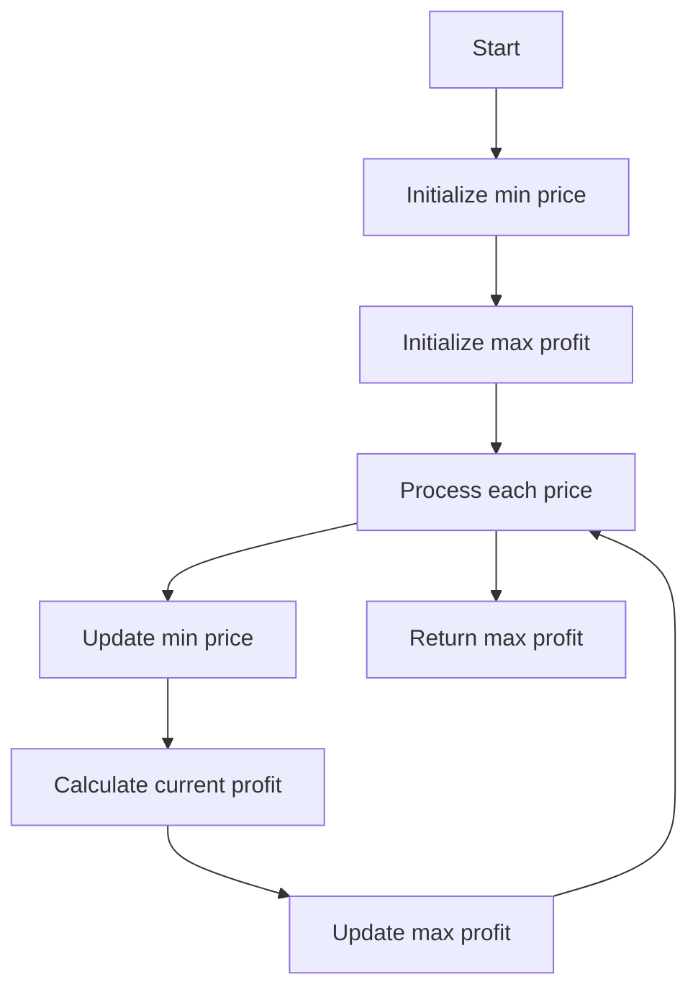
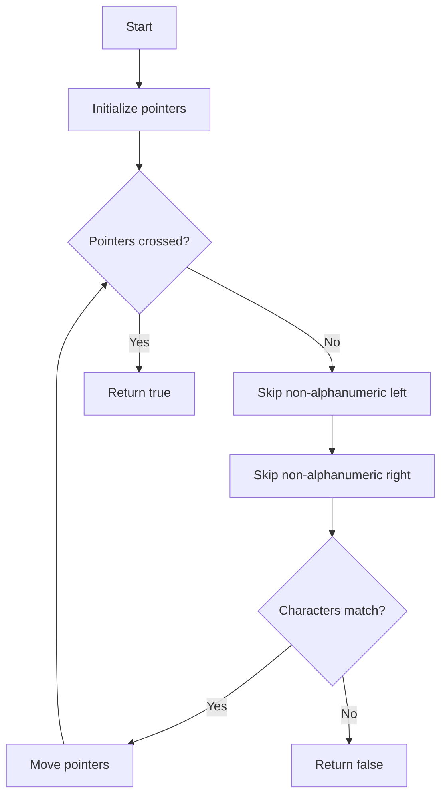
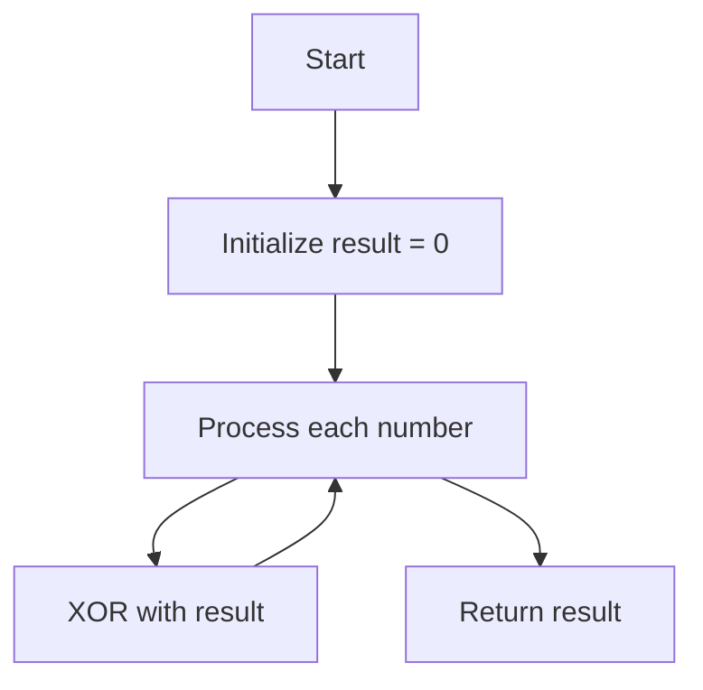
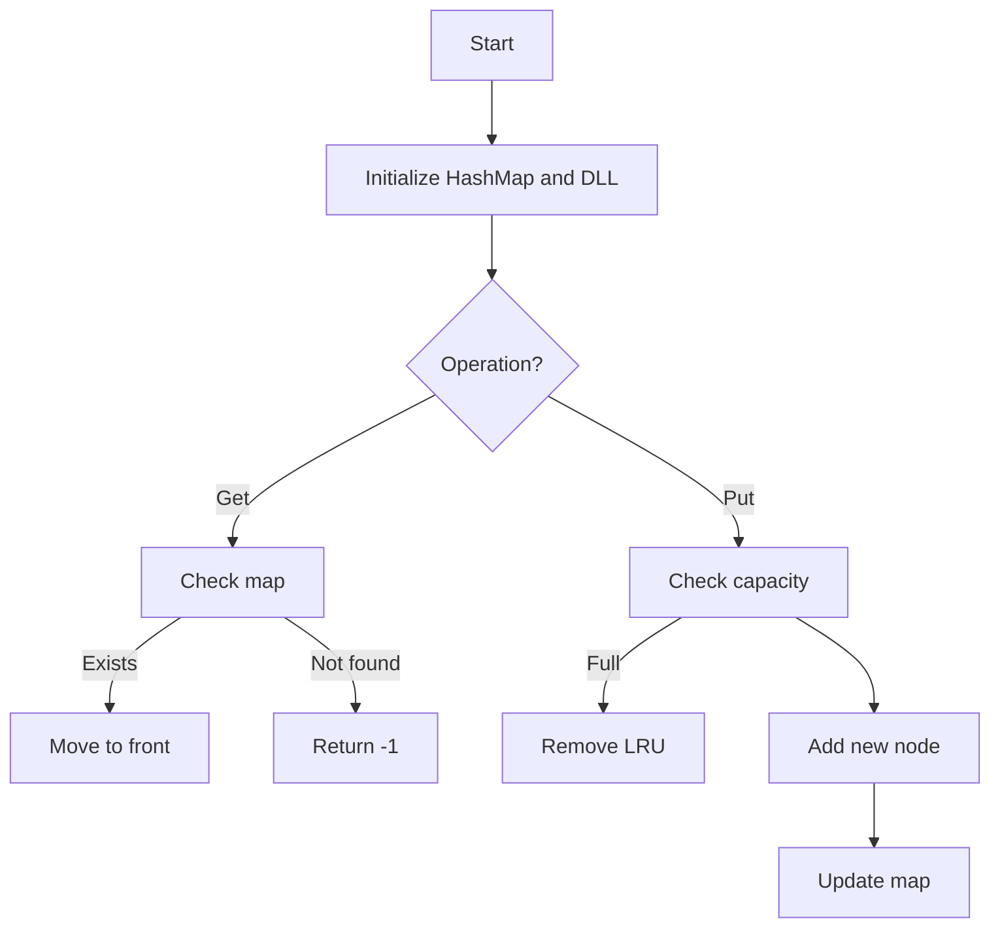
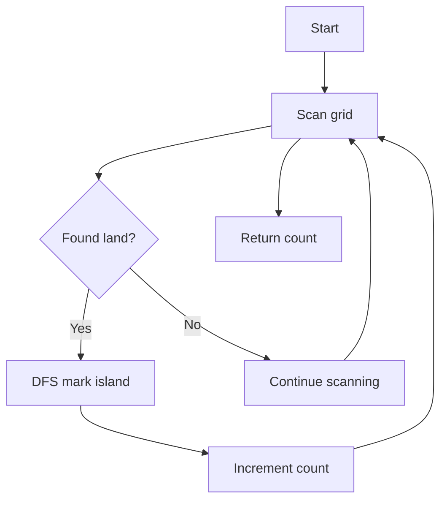
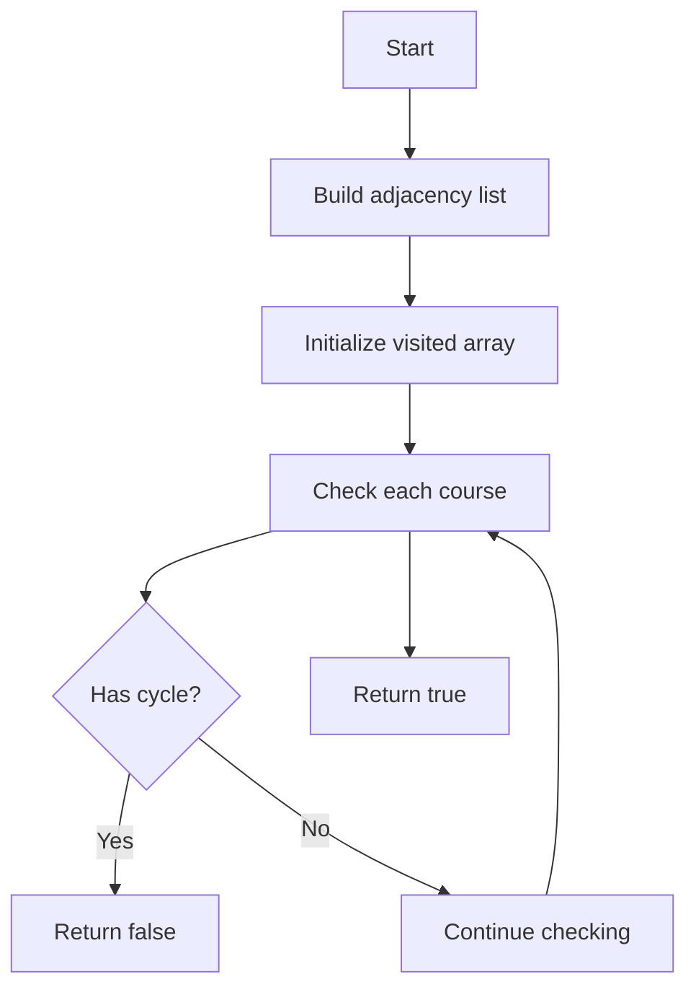

# LeetCode Problems 11-20: Visual Flows and Java Implementation

## 11. Climbing Stairs

<table>
<tr>
<td width="50%">



</td>
<td width="50%">

```java
public int climbStairs(int n) {
    if (n <= 2) return n;
    
    int prev1 = 1; // n-1
    int prev2 = 2; // n-2
    int current = 0;
    
    for (int i = 3; i <= n; i++) {
        current = prev1 + prev2;
        prev1 = prev2;
        prev2 = current;
    }
    
    return prev2;
}
```

</td>
</tr>
</table>

## 12. Binary Tree Inorder Traversal

<table>
<tr>
<td width="50%">



</td>
<td width="50%">

```java
public List<Integer> inorderTraversal(
    TreeNode root) {
    List<Integer> result = new ArrayList<>();
    Stack<TreeNode> stack = new Stack<>();
    TreeNode current = root;
    
    while (current != null || 
           !stack.isEmpty()) {
        while (current != null) {
            stack.push(current);
            current = current.left;
        }
        
        current = stack.pop();
        result.add(current.val);
        current = current.right;
    }
    
    return result;
}
```

</td>
</tr>
</table>

## 13. Symmetric Tree

<table>
<tr>
<td width="50%">



</td>
<td width="50%">

```java
public boolean isSymmetric(TreeNode root) {
    if (root == null) return true;
    return isMirror(root.left, root.right);
}

private boolean isMirror(TreeNode left, 
                        TreeNode right) {
    if (left == null && right == null) 
        return true;
    if (left == null || right == null) 
        return false;
        
    return (left.val == right.val) &&
           isMirror(left.left, right.right) &&
           isMirror(left.right, right.left);
}
```

</td>
</tr>
</table>

## 14. Maximum Depth of Binary Tree

<table>
<tr>
<td width="50%">



</td>
<td width="50%">

```java
public int maxDepth(TreeNode root) {
    if (root == null) return 0;
    
    int leftDepth = maxDepth(root.left);
    int rightDepth = maxDepth(root.right);
    
    return Math.max(leftDepth, rightDepth) + 1;
}
```

</td>
</tr>
</table>

## 15. Best Time to Buy and Sell Stock

<table>
<tr>
<td width="50%">



</td>
<td width="50%">

```java
public int maxProfit(int[] prices) {
    if (prices == null || prices.length < 2) 
        return 0;
        
    int minPrice = prices[0];
    int maxProfit = 0;
    
    for (int i = 1; i < prices.length; i++) {
        minPrice = Math.min(minPrice, prices[i]);
        maxProfit = Math.max(maxProfit, 
                            prices[i] - minPrice);
    }
    
    return maxProfit;
}
```

</td>
</tr>
</table>

## 16. Valid Palindrome

<table>
<tr>
<td width="50%">



</td>
<td width="50%">

```java
public boolean isPalindrome(String s) {
    int left = 0;
    int right = s.length() - 1;
    
    while (left < right) {
        while (left < right && 
               !Character.isLetterOrDigit(
                   s.charAt(left))) {
            left++;
        }
        while (left < right && 
               !Character.isLetterOrDigit(
                   s.charAt(right))) {
            right--;
        }
        
        if (Character.toLowerCase(
                s.charAt(left)) != 
            Character.toLowerCase(
                s.charAt(right))) {
            return false;
        }
        
        left++;
        right--;
    }
    
    return true;
}
```

</td>
</tr>
</table>

## 17. Single Number

<table>
<tr>
<td width="50%">



</td>
<td width="50%">

```java
public int singleNumber(int[] nums) {
    int result = 0;
    
    for (int num : nums) {
        result ^= num;
    }
    
    return result;
}
```

</td>
</tr>
</table>

## 18. LRU Cache

<table>
<tr>
<td width="50%">



</td>
<td width="50%">

```java
class LRUCache {
    class Node {
        int key, value;
        Node prev, next;
        Node(int k, int v) {
            key = k;
            value = v;
        }
    }
    
    private Map<Integer, Node> cache;
    private Node head, tail;
    private int capacity;
    
    public LRUCache(int capacity) {
        this.capacity = capacity;
        cache = new HashMap<>();
        head = new Node(0, 0);
        tail = new Node(0, 0);
        head.next = tail;
        tail.prev = head;
    }
    
    public int get(int key) {
        Node node = cache.get(key);
        if (node == null) return -1;
        moveToHead(node);
        return node.value;
    }
    
    public void put(int key, int value) {
        Node node = cache.get(key);
        if (node != null) {
            node.value = value;
            moveToHead(node);
        } else {
            Node newNode = new Node(key, value);
            cache.put(key, newNode);
            addNode(newNode);
            if (cache.size() > capacity) {
                Node lru = tail.prev;
                removeNode(lru);
                cache.remove(lru.key);
            }
        }
    }
    
    private void addNode(Node node) {
        node.prev = head;
        node.next = head.next;
        head.next.prev = node;
        head.next = node;
    }
    
    private void removeNode(Node node) {
        node.prev.next = node.next;
        node.next.prev = node.prev;
    }
    
    private void moveToHead(Node node) {
        removeNode(node);
        addNode(node);
    }
}
```

</td>
</tr>
</table>

## 19. Number of Islands

<table>
<tr>
<td width="50%">



</td>
<td width="50%">

```java
public int numIslands(char[][] grid) {
    if (grid == null || grid.length == 0) 
        return 0;
        
    int count = 0;
    for (int i = 0; i < grid.length; i++) {
        for (int j = 0; j < grid[0].length; j++) {
            if (grid[i][j] == '1') {
                count++;
                dfs(grid, i, j);
            }
        }
    }
    return count;
}

private void dfs(char[][] grid, int i, int j) {
    if (i < 0 || i >= grid.length || 
        j < 0 || j >= grid[0].length || 
        grid[i][j] != '1') return;
        
    grid[i][j] = '0';
    
    dfs(grid, i + 1, j);
    dfs(grid, i - 1, j);
    dfs(grid, i, j + 1);
    dfs(grid, i, j - 1);
}
```

</td>
</tr>
</table>

## 20. Course Schedule

<table>
<tr>
<td width="50%">



</td>
<td width="50%">

```java
public boolean canFinish(int numCourses, 
                        int[][] prerequisites) {
    List<List<Integer>> adj = new ArrayList<>();
    for (int i = 0; i < numCourses; i++) {
        adj.add(new ArrayList<>());
    }
    
    for (int[] pre : prerequisites) {
        adj.get(pre[0]).add(pre[1]);
    }
    
    int[] visited = new int[numCourses];
    
    for (int i = 0; i < numCourses; i++) {
        if (hasCycle(i, adj, visited)) {
            return false;
        }
    }
    return true;
}

private boolean hasCycle(int course, 
                        List<List<Integer>> adj, 
                        int[] visited) {
    if (visited[course] == 1) return true;
    if (visited[course] == 2) return false;
    
    visited[course] = 1;
    
    for (int neighbor : adj.get(course)) {
        if (hasCycle(neighbor, adj, visited)) {
            return true;
        }
    }
    
    visited[course] = 2;
    return false;
}
```

</td>
</tr>
</table>

Each problem includes:
- Mermaid flow diagram showing algorithm steps
- Java implementation with proper formatting
- Clear visualization of the process
- Both iterative and recursive solutions where applicable

Would you like me to:
1. Add time/space complexity analysis?
2. Provide alternative solutions for any problem?
3. Add more detailed comments to the code?
4. Expand any particular flow diagram?