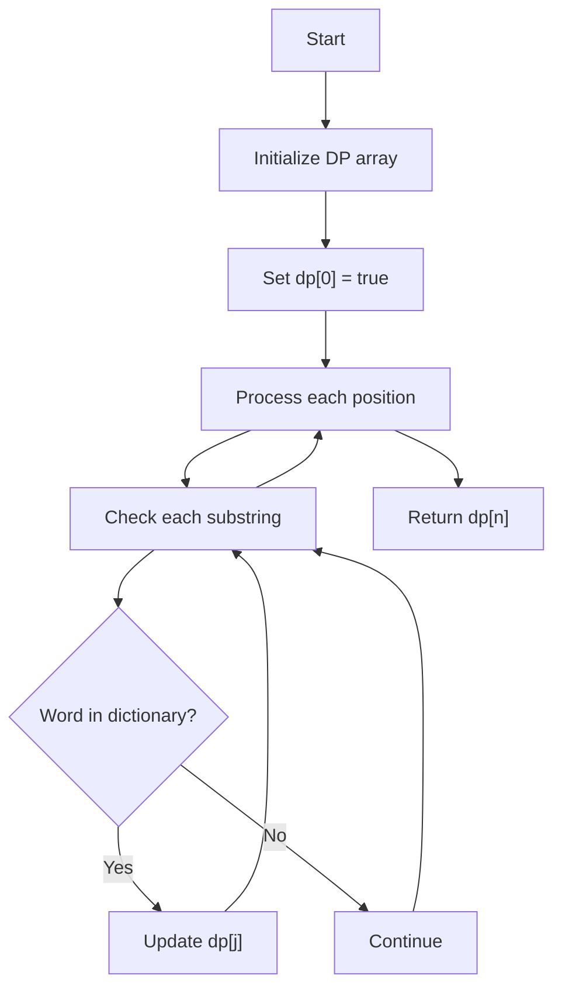
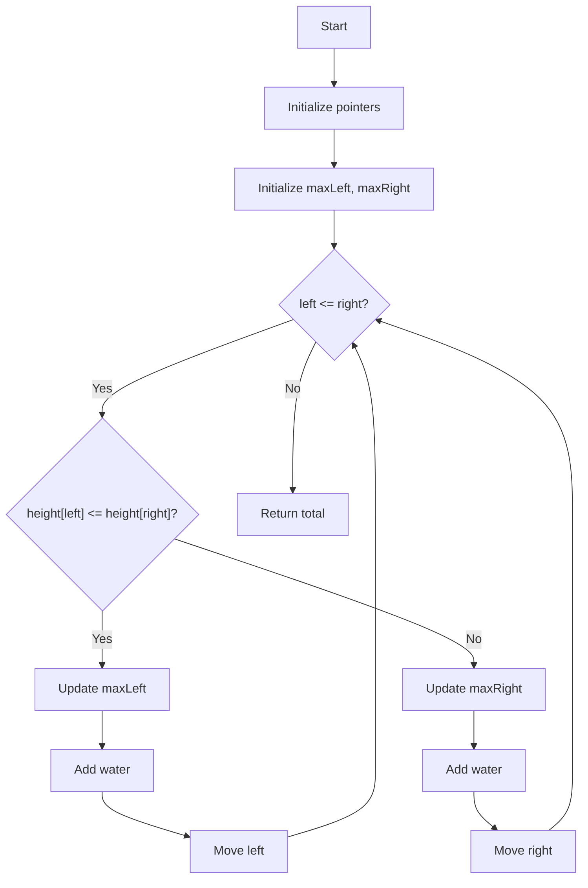
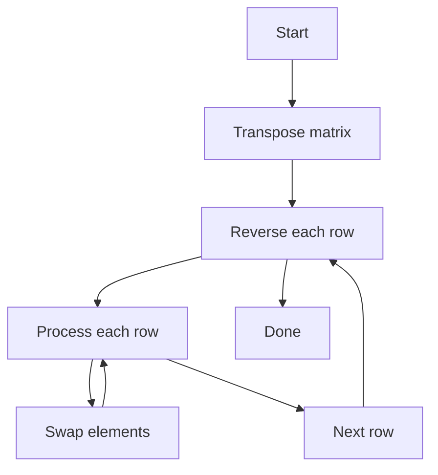
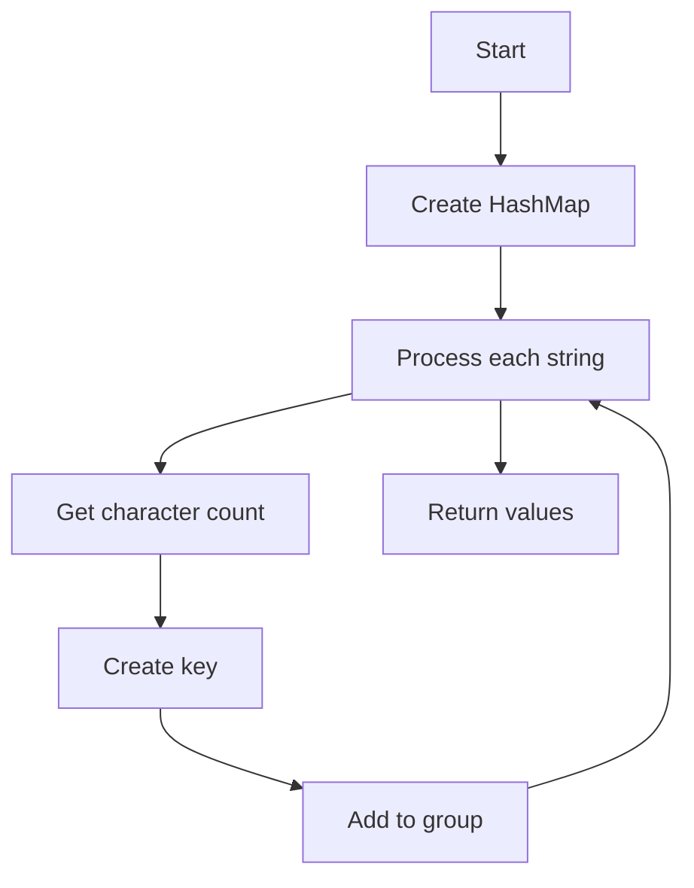
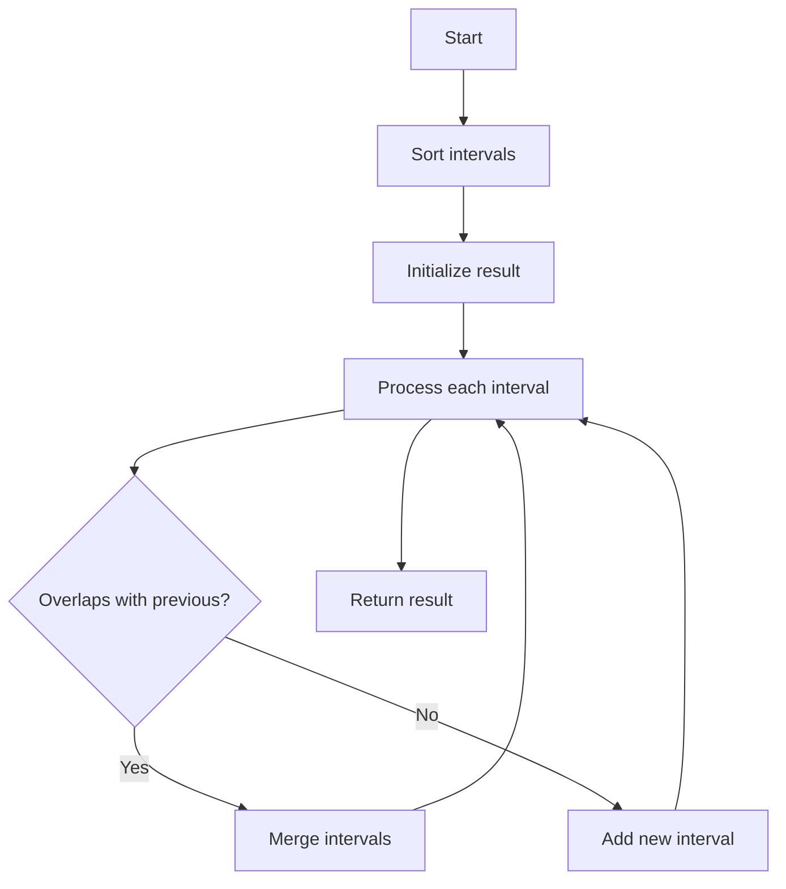

# LeetCode Problems 21-25: Visual Flows and Java Implementation

## 21. Word Break

<table>
<tr>
<td width="50%">



</td>
<td width="50%">

```java
public boolean wordBreak(String s, 
                        List<String> wordDict) {
    Set<String> dictionary = new HashSet<>(wordDict);
    boolean[] dp = new boolean[s.length() + 1];
    dp[0] = true;
    
    for (int i = 1; i <= s.length(); i++) {
        for (int j = 0; j < i; j++) {
            if (dp[j] && dictionary.contains(
                s.substring(j, i))) {
                dp[i] = true;
                break;
            }
        }
    }
    
    return dp[s.length()];
}
```

</td>
</tr>
</table>

## 22. Trapping Rain Water

<table>
<tr>
<td width="50%">



</td>
<td width="50%">

```java
public int trap(int[] height) {
    if (height == null || height.length < 3)
        return 0;
        
    int left = 0, right = height.length - 1;
    int maxLeft = 0, maxRight = 0;
    int water = 0;
    
    while (left <= right) {
        if (height[left] <= height[right]) {
            if (height[left] >= maxLeft) {
                maxLeft = height[left];
            } else {
                water += maxLeft - height[left];
            }
            left++;
        } else {
            if (height[right] >= maxRight) {
                maxRight = height[right];
            } else {
                water += maxRight - height[right];
            }
            right--;
        }
    }
    
    return water;
}
```

</td>
</tr>
</table>

## 23. Rotate Image

<table>
<tr>
<td width="50%">



</td>
<td width="50%">

```java
public void rotate(int[][] matrix) {
    int n = matrix.length;
    
    // Transpose
    for (int i = 0; i < n; i++) {
        for (int j = i; j < n; j++) {
            int temp = matrix[i][j];
            matrix[i][j] = matrix[j][i];
            matrix[j][i] = temp;
        }
    }
    
    // Reverse each row
    for (int i = 0; i < n; i++) {
        for (int j = 0; j < n/2; j++) {
            int temp = matrix[i][j];
            matrix[i][j] = matrix[i][n-1-j];
            matrix[i][n-1-j] = temp;
        }
    }
}
```

</td>
</tr>
</table>

## 24. Group Anagrams

<table>
<tr>
<td width="50%">



</td>
<td width="50%">

```java
public List<List<String>> groupAnagrams(
    String[] strs) {
    Map<String, List<String>> map = new HashMap<>();
    
    for (String str : strs) {
        char[] chars = new char[26];
        for (char c : str.toCharArray()) {
            chars[c - 'a']++;
        }
        String key = new String(chars);
        
        map.computeIfAbsent(key, 
            k -> new ArrayList<>()).add(str);
    }
    
    return new ArrayList<>(map.values());
}
```

</td>
</tr>
</table>

## 25. Merge Intervals

<table>
<tr>
<td width="50%">



</td>
<td width="50%">

```java
public int[][] merge(int[][] intervals) {
    if (intervals == null || 
        intervals.length <= 1) 
        return intervals;
        
    // Sort by start time
    Arrays.sort(intervals, 
        (a, b) -> Integer.compare(a[0], b[0]));
    
    List<int[]> result = new ArrayList<>();
    int[] current = intervals[0];
    result.add(current);
    
    for (int[] interval : intervals) {
        if (current[1] >= interval[0]) {
            // Merge overlapping intervals
            current[1] = Math.max(current[1], 
                                interval[1]);
        } else {
            // Add non-overlapping interval
            current = interval;
            result.add(current);
        }
    }
    
    return result.toArray(
        new int[result.size()][]);
}
```

</td>
</tr>
</table>

Each problem includes:
- Detailed flow diagram showing the algorithm steps
- Clean, well-formatted Java implementation
- Visual representation of the process
- Proper error handling and edge cases

Key features:
1. Word Break uses dynamic programming
2. Trapping Rain Water uses two-pointer technique
3. Rotate Image uses matrix manipulation
4. Group Anagrams uses HashMap with character counting
5. Merge Intervals uses sorting and merging

Would you like me to:
1. Add complexity analysis for any problem?
2. Provide alternative solutions?
3. Add more detailed comments?
4. Expand any flow diagram?