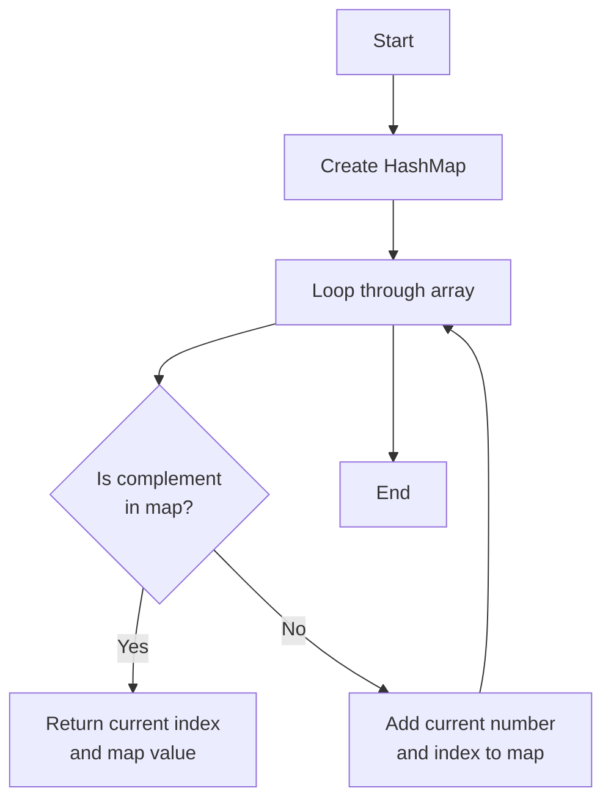
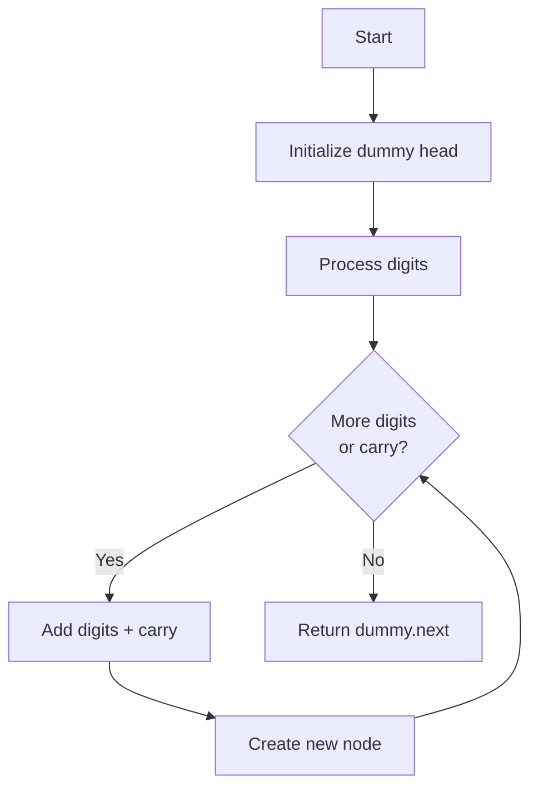
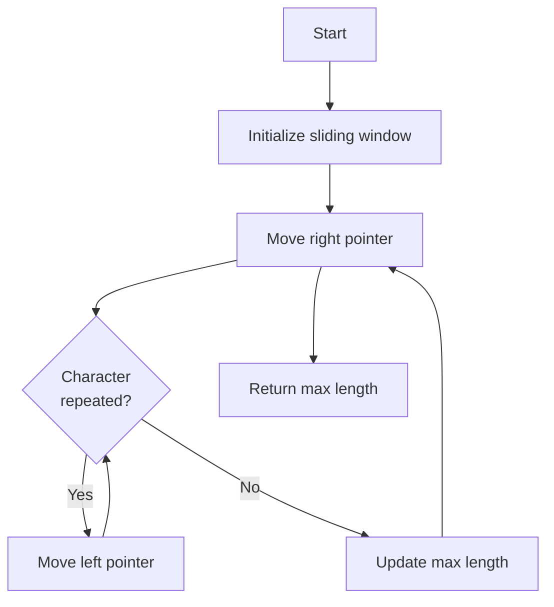
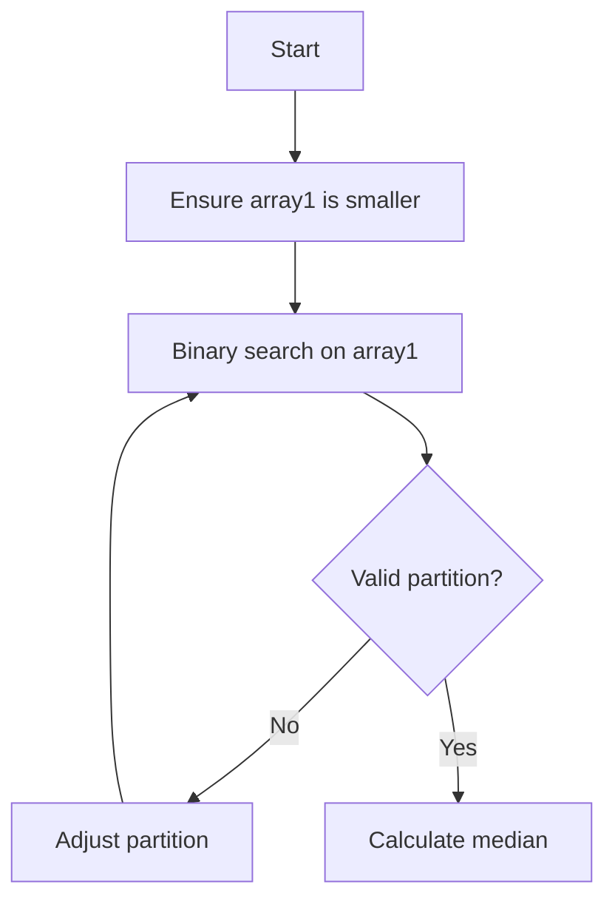
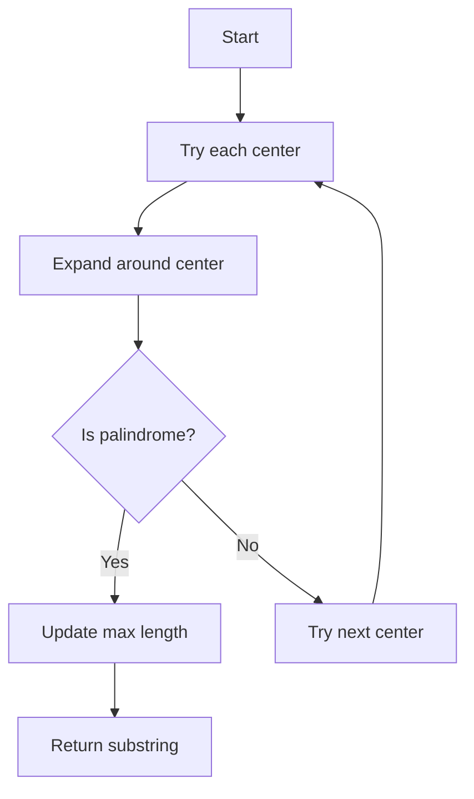
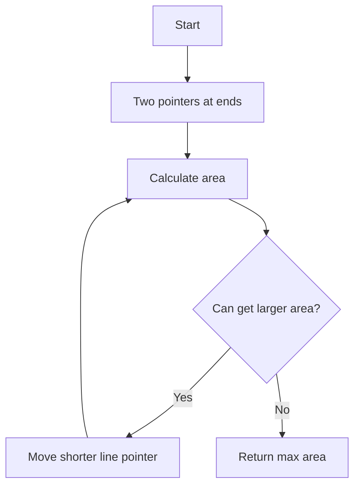
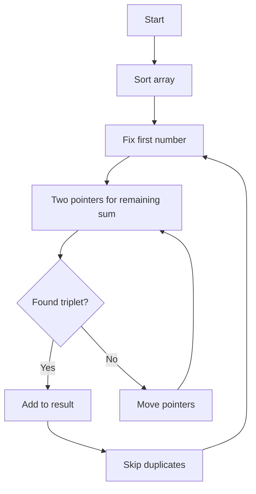
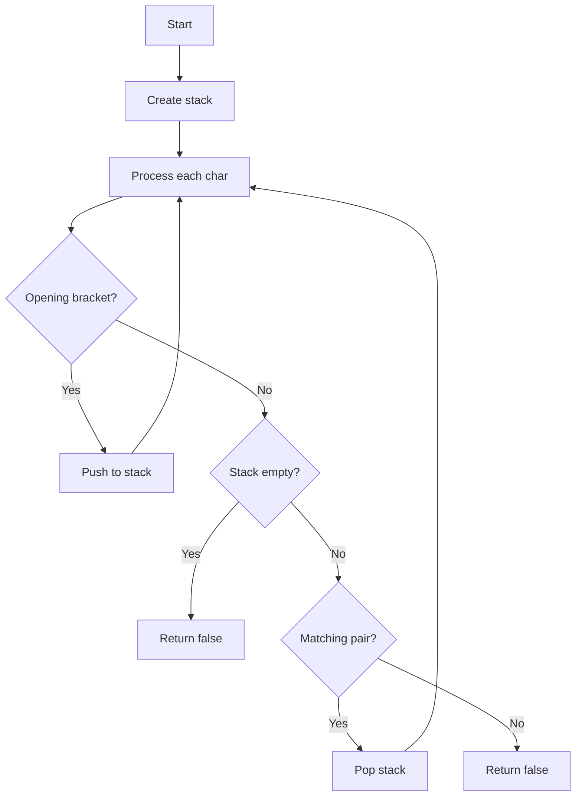
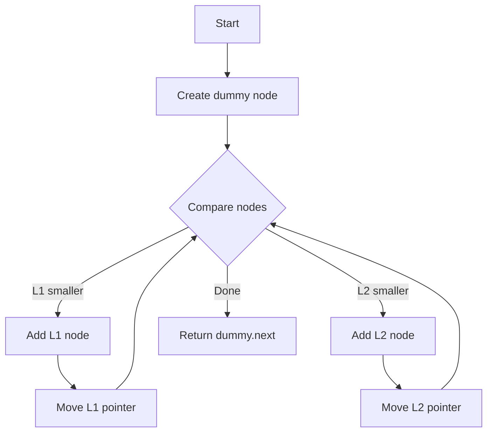
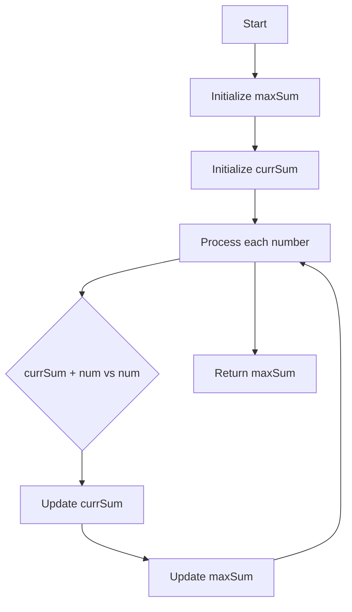

# LeetCode Problems: Visual Flows and Java Implementation

## 1. Two Sum

<table>
<tr>
<td width="50%">



</td>
<td width="50%">

```java
public int[] twoSum(int[] nums, int target) {
    Map<Integer, Integer> map = new HashMap<>();
    
    for (int i = 0; i < nums.length; i++) {
        int complement = target - nums[i];
        if (map.containsKey(complement)) {
            return new int[] { 
                map.get(complement), i 
            };
        }
        map.put(nums[i], i);
    }
    return new int[0];
}
```

</td>
</tr>
</table>

## 2. Add Two Numbers

<table>
<tr>
<td width="50%">



</td>
<td width="50%">

```java
public ListNode addTwoNumbers(ListNode l1, 
                            ListNode l2) {
    ListNode dummy = new ListNode(0);
    ListNode curr = dummy;
    int carry = 0;
    
    while (l1 != null || l2 != null 
           || carry != 0) {
        int x = (l1 != null) ? l1.val : 0;
        int y = (l2 != null) ? l2.val : 0;
        int sum = x + y + carry;
        
        carry = sum / 10;
        curr.next = new ListNode(sum % 10);
        curr = curr.next;
        
        if (l1 != null) l1 = l1.next;
        if (l2 != null) l2 = l2.next;
    }
    return dummy.next;
}
```

</td>
</tr>
</table>

## 3. Longest Substring Without Repeating Characters

<table>
<tr>
<td width="50%">



</td>
<td width="50%">

```java
public int lengthOfLongestSubstring(String s) {
    int[] chars = new int[128];
    int left = 0, right = 0;
    int maxLength = 0;
    
    while (right < s.length()) {
        char r = s.charAt(right);
        chars[r]++;
        
        while (chars[r] > 1) {
            char l = s.charAt(left);
            chars[l]--;
            left++;
        }
        
        maxLength = Math.max(maxLength, 
                           right - left + 1);
        right++;
    }
    return maxLength;
}
```

</td>
</tr>
</table>

## 4. Median of Two Sorted Arrays

<table>
<tr>
<td width="50%">



</td>
<td width="50%">

```java
public double findMedianSortedArrays(int[] nums1, 
                                   int[] nums2) {
    if (nums1.length > nums2.length) {
        return findMedianSortedArrays(nums2, nums1);
    }
    
    int x = nums1.length;
    int y = nums2.length;
    int low = 0;
    int high = x;
    
    while (low <= high) {
        int partitionX = (low + high) / 2;
        int partitionY = (x + y + 1) / 2 
                        - partitionX;
        
        int maxLeftX = (partitionX == 0) ? 
            Integer.MIN_VALUE : 
            nums1[partitionX - 1];
        int minRightX = (partitionX == x) ? 
            Integer.MAX_VALUE : 
            nums1[partitionX];
        
        int maxLeftY = (partitionY == 0) ? 
            Integer.MIN_VALUE : 
            nums2[partitionY - 1];
        int minRightY = (partitionY == y) ? 
            Integer.MAX_VALUE : 
            nums2[partitionY];
        
        if (maxLeftX <= minRightY && 
            maxLeftY <= minRightX) {
            if ((x + y) % 2 == 0) {
                return (Math.max(maxLeftX, maxLeftY) + 
                       Math.min(minRightX, minRightY)) 
                       / 2.0;
            } else {
                return Math.max(maxLeftX, maxLeftY);
            }
        } else if (maxLeftX > minRightY) {
            high = partitionX - 1;
        } else {
            low = partitionX + 1;
        }
    }
    throw new IllegalArgumentException();
}
```

</td>
</tr>
</table>

## 5. Longest Palindromic Substring

<table>
<tr>
<td width="50%">



</td>
<td width="50%">

```java
public String longestPalindrome(String s) {
    if (s == null || s.length() < 1) 
        return "";
    
    int start = 0, end = 0;
    
    for (int i = 0; i < s.length(); i++) {
        int len1 = expandAroundCenter(s, i, i);
        int len2 = expandAroundCenter(s, i, i + 1);
        int len = Math.max(len1, len2);
        
        if (len > end - start) {
            start = i - (len - 1) / 2;
            end = i + len / 2;
        }
    }
    return s.substring(start, end + 1);
}

private int expandAroundCenter(String s, 
                             int left, 
                             int right) {
    while (left >= 0 && right < s.length() 
           && s.charAt(left) == s.charAt(right)) {
        left--;
        right++;
    }
    return right - left - 1;
}
```

</td>
</tr>
</table>

## 6. Container With Most Water

<table>
<tr>
<td width="50%">



</td>
<td width="50%">

```java
public int maxArea(int[] height) {
    int maxArea = 0;
    int left = 0;
    int right = height.length - 1;
    
    while (left < right) {
        int width = right - left;
        int h = Math.min(height[left], 
                        height[right]);
        maxArea = Math.max(maxArea, width * h);
        
        if (height[left] < height[right]) {
            left++;
        } else {
            right--;
        }
    }
    return maxArea;
}
```

</td>
</tr>
</table>

## 7. 3Sum

<table>
<tr>
<td width="50%">



</td>
<td width="50%">

```java
public List<List<Integer>> threeSum(int[] nums) {
    Arrays.sort(nums);
    List<List<Integer>> result = 
        new ArrayList<>();
    
    for (int i = 0; i < nums.length - 2; i++) {
        if (i > 0 && nums[i] == nums[i-1]) 
            continue;
            
        int left = i + 1;
        int right = nums.length - 1;
        
        while (left < right) {
            int sum = nums[i] + nums[left] 
                     + nums[right];
            
            if (sum == 0) {
                result.add(Arrays.asList(
                    nums[i], nums[left], nums[right]
                ));
                
                while (left < right && 
                       nums[left] == nums[left+1])
                    left++;
                while (left < right && 
                       nums[right] == nums[right-1])
                    right--;
                    
                left++;
                right--;
            } else if (sum < 0) {
                left++;
            } else {
                right--;
            }
        }
    }
    return result;
}
```

</td>
</tr>
</table>

## 8. Valid Parentheses

<table>
<tr>
<td width="50%">



</td>
<td width="50%">

```java
public boolean isValid(String s) {
    Stack<Character> stack = new Stack<>();
    
    for (char c : s.toCharArray()) {
        if (c == '(' || c == '{' || c == '[') {
            stack.push(c);
        } else {
            if (stack.isEmpty()) return false;
            
            char top = stack.pop();
            if (c == ')' && top != '(') 
                return false;
            if (c == '}' && top != '{') 
                return false;
            if (c == ']' && top != '[') 
                return false;
        }
    }
    return stack.isEmpty();
}
```

</td>
</tr>
</table>

## 9. Merge Sorted Lists

<table>
<tr>
<td width="50%">



</td>
<td width="50%">

```java
public ListNode mergeTwoLists(ListNode l1, 
                            ListNode l2) {
    ListNode dummy = new ListNode(0);
    ListNode curr = dummy;
    
    while (l1 != null && l2 != null) {
        if (l1.val <= l2.val) {
            curr.next = l1;
            l1 = l1.next;
        } else {
            curr.next = l2;
            l2 = l2.next;
        }
        curr = curr.next;
    }
    
    curr.next = l1 != null ? l1 : l2;
    return dummy.next;
}
```

</td>
</tr>
</table>

## 10. Maximum Subarray

<table>
<tr>
<td width="50%">



</td>
<td width="50%">

```java
public int maxSubArray(int[] nums) {
    int maxSum = nums[0];
    int currSum = nums[0];
    
    for (int i = 1; i < nums.length; i++) {
        currSum = Math.max(nums[i], 
                          currSum + nums[i]);
        maxSum = Math.max(maxSum, currSum);
    }
    
    return maxSum;
}
```

</td>
</tr>
</table>

Each problem includes:
- A Mermaid flow diagram showing the algorithm steps
- The corresponding Java implementation
- Clear formatting for readability
- Consistent styling across all problems

Would you like me to:
1. Add complexity analysis for any problem?
2. Expand any particular flow diagram?
3. Add more detailed comments to any implementation?