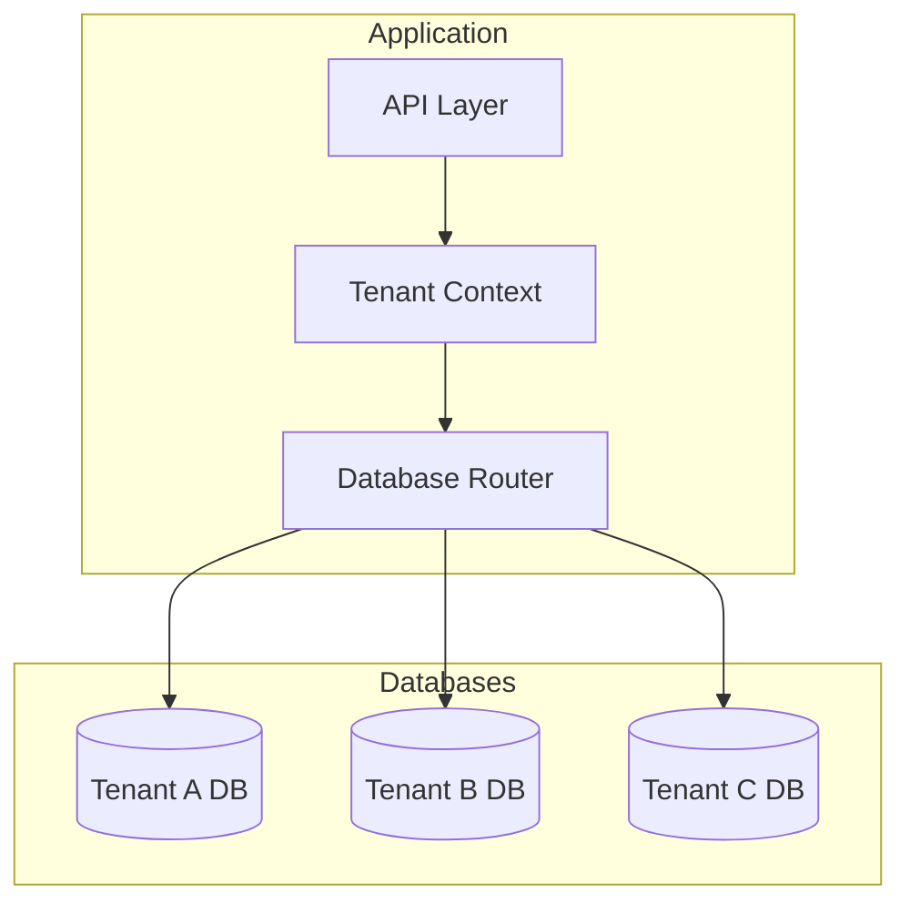
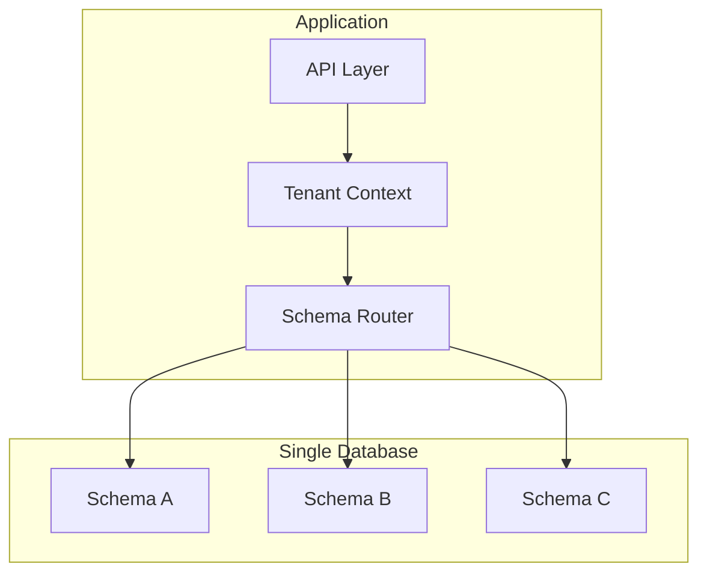
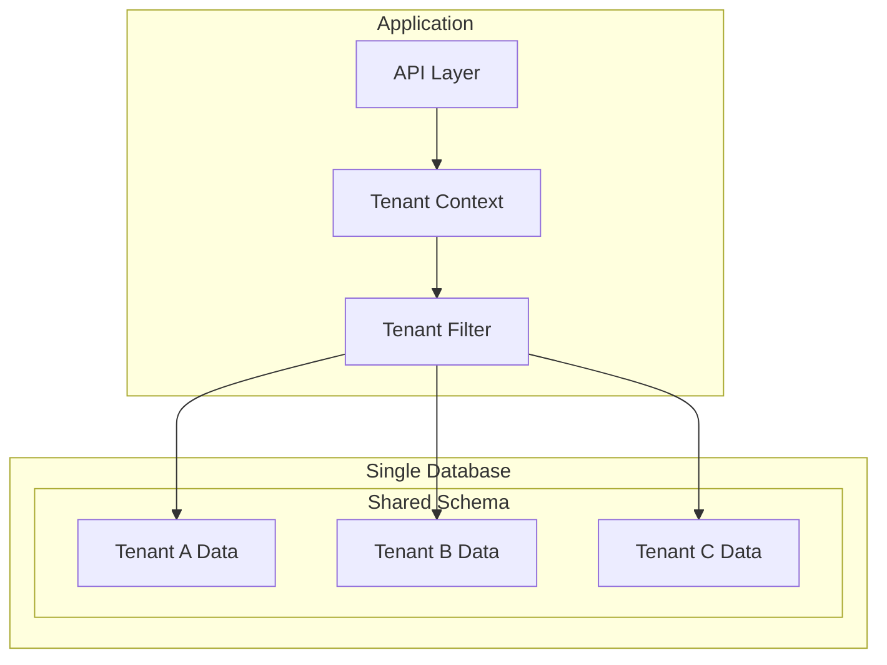

# Multi-tenant Architecture Implementation Guide

## Table of Contents
1. [Overview](#overview)
2. [Implementation Approaches](#implementation-approaches)
3. [Database Patterns](#database-patterns)
4. [Best Practices](#best-practices)
5. [Implementation Examples](#implementation-examples)
6. [Security Considerations](#security-considerations)
7. [Performance Optimization](#performance-optimization)

## Overview

Multi-tenancy is an architecture where a single instance of software serves multiple customers (tenants). Each approach has its trade-offs in terms of:
- Data isolation
- Security
- Resource utilization
- Maintenance complexity
- Cost effectiveness

## Implementation Approaches

### 1. Separate Databases Pattern



#### Advantages:
- Maximum data isolation
- Easier regulatory compliance
- Independent scaling
- Simplified backup and restore

#### Disadvantages:
- Higher infrastructure costs
- More complex maintenance
- Resource underutilization
- Complex deployment

#### Implementation Example:
```java
@Configuration
public class DataSourceConfig {
    @Bean
    public DataSource dataSource() {
        AbstractRoutingDataSource dataSource = new TenantAwareRoutingDataSource();
        Map<Object, Object> targetDataSources = new HashMap<>();
        
        targetDataSources.put("tenant1", createDataSource("db_tenant1"));
        targetDataSources.put("tenant2", createDataSource("db_tenant2"));
        
        dataSource.setTargetDataSources(targetDataSources);
        return dataSource;
    }
}
```

### 2. Separate Schema Pattern



#### Advantages:
- Good data isolation
- Easier schema evolution
- Moderate costs
- Simplified backup per tenant

#### Disadvantages:
- Limited by database schema limits
- Moderate maintenance complexity
- Connection pool management challenges

#### Implementation Example:
```java
@Component
public class TenantSchemaInterceptor {
    @PostConstruct
    public void init() {
        // Set schema for current tenant
        String schema = String.format("schema_%s", 
            TenantContext.getCurrentTenant());
        jdbcTemplate.execute("USE " + schema);
    }
}
```

### 3. Shared Database, Shared Schema Pattern



#### Advantages:
- Lowest infrastructure costs
- Simplified maintenance
- Efficient resource utilization
- Easier updates and deployments

#### Disadvantages:
- Limited data isolation
- More complex tenant data separation
- Potential performance impacts
- Complex backup per tenant

#### Implementation Example:
```java
@Entity
@Table(name = "products")
public class Product {
    @Column(name = "tenant_id", nullable = false)
    private String tenantId;
    
    @PrePersist
    @PreUpdate
    public void setTenant() {
        this.tenantId = TenantContext.getCurrentTenant();
    }
}
```

## Best Practices

### 1. Data Isolation
- Use row-level security when possible
- Implement tenant validation at all layers
- Create separate backup strategies per tenant
- Use tenant-specific encryption keys

```sql
-- Example of row-level security in PostgreSQL
CREATE POLICY tenant_isolation_policy ON products
    USING (tenant_id = current_tenant_id());
```

### 2. Performance
- Index tenant columns
- Partition large tables by tenant_id
- Use connection pooling effectively
- Cache tenant-specific data

```sql
-- Example of table partitioning
CREATE TABLE products (
    id BIGINT,
    tenant_id VARCHAR(50),
    name VARCHAR(255)
) PARTITION BY LIST (tenant_id);
```

### 3. Security
- Implement tenant context validation
- Use prepared statements
- Encrypt sensitive data
- Implement API rate limiting per tenant

```java
public class TenantSecurityAspect {
    @Before("execution(* com.example.service.*.*(..))")
    public void validateTenant() {
        String currentTenant = TenantContext.getCurrentTenant();
        if (!tenantValidationService.isValid(currentTenant)) {
            throw new UnauthorizedException();
        }
    }
}
```

### 4. Monitoring
- Track resource usage per tenant
- Monitor performance per tenant
- Set up tenant-specific alerts
- Implement tenant-aware logging

```java
@Slf4j
public class TenantAwareLogger {
    public void logEvent(String message) {
        String tenant = TenantContext.getCurrentTenant();
        log.info("[Tenant: {}] {}", tenant, message);
    }
}
```

## Implementation Examples

### Database Migration Strategy

```java
@Component
public class TenantAwareLiquibase {
    public void migrate() {
        List<String> tenants = tenantService.getAllTenants();
        for (String tenant : tenants) {
            try {
                TenantContext.setCurrentTenant(tenant);
                liquibase.update(tenant);
            } finally {
                TenantContext.clear();
            }
        }
    }
}
```

### Tenant Management Service

```java
@Service
public class TenantManagementService {
    public void createTenant(String tenantId) {
        // For separate DB approach
        createDatabase(tenantId);
        runMigrations(tenantId);
        
        // For separate schema approach
        createSchema(tenantId);
        initializeTables(tenantId);
        
        // For shared approach
        initializeTenantData(tenantId);
    }
}
```

## Security Considerations

### 1. Data Access Control
- Implement tenant-aware repositories
- Use aspect-oriented programming for tenant validation
- Implement tenant-specific encryption

```java
@Repository
public interface ProductRepository extends JpaRepository<Product, Long> {
    @Query("SELECT p FROM Product p WHERE p.tenantId = :#{tenantContext.currentTenant}")
    List<Product> findAllForCurrentTenant();
}
```

### 2. Authentication & Authorization
- Implement tenant-aware authentication
- Use JWT with tenant information
- Implement role-based access control per tenant

```java
public class TenantAwareAuthenticationToken extends UsernamePasswordAuthenticationToken {
    private final String tenantId;
    
    // Constructor and methods
}
```

## Performance Optimization

### 1. Caching Strategy
- Implement tenant-aware caching
- Use cache key prefixes per tenant
- Configure cache sizes per tenant

```java
@Cacheable(key = "#tenantId + ':' + #root.method.name")
public List<Product> getProducts(String tenantId) {
    return productRepository.findByTenantId(tenantId);
}
```

### 2. Connection Pool Management
- Configure pool sizes based on tenant usage
- Implement tenant-aware connection pooling
- Monitor connection usage per tenant

```java
@Configuration
public class TenantAwareHikariConfig {
    public DataSource createDataSource(String tenantId) {
        HikariConfig config = new HikariConfig();
        config.setPoolName("pool-" + tenantId);
        config.setMaximumPoolSize(getTenantPoolSize(tenantId));
        return new HikariDataSource(config);
    }
}
```

### 3. Query Optimization
- Index tenant columns effectively
- Use tenant-specific materialized views
- Implement tenant-aware query caching

```sql
-- Example of tenant-specific indexing
CREATE INDEX idx_tenant_product ON products (tenant_id, id);
CREATE INDEX idx_tenant_category ON products (tenant_id, category);
```

By following these patterns and best practices, you can build a robust multi-tenant application that is secure, performant, and maintainable.
