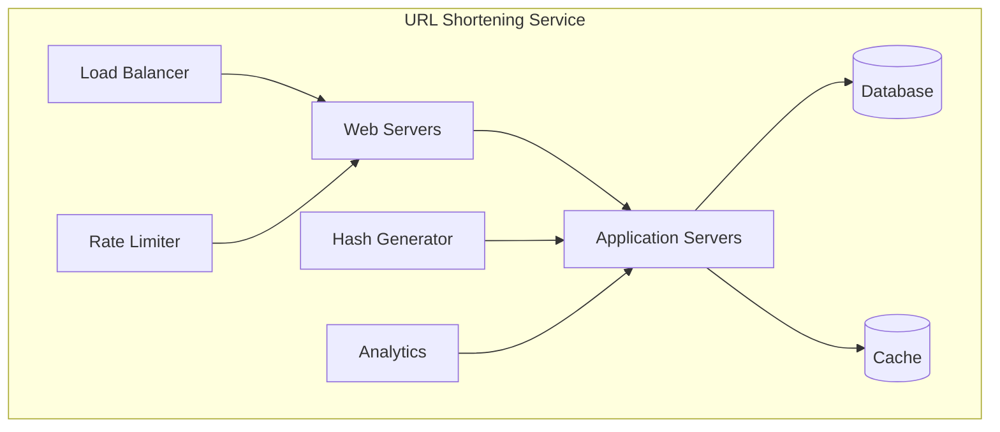
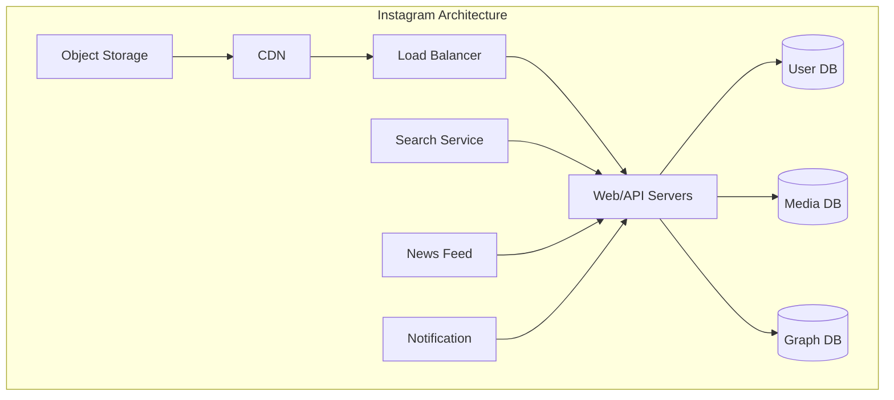
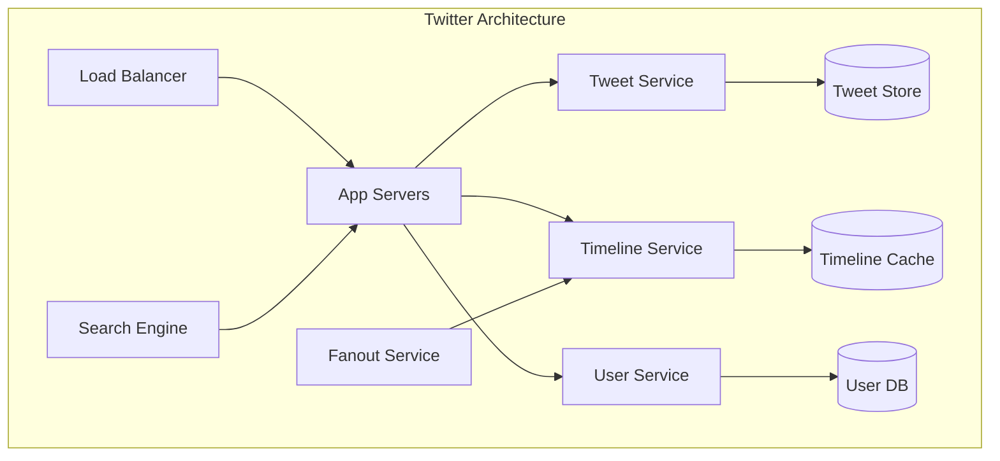
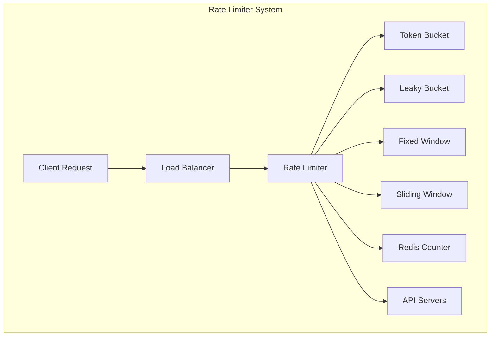
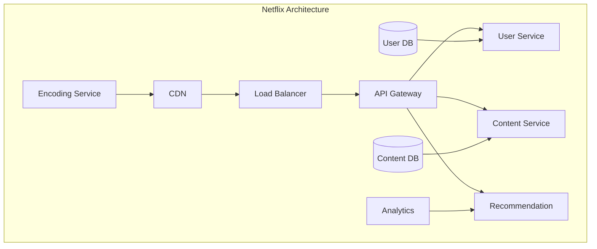
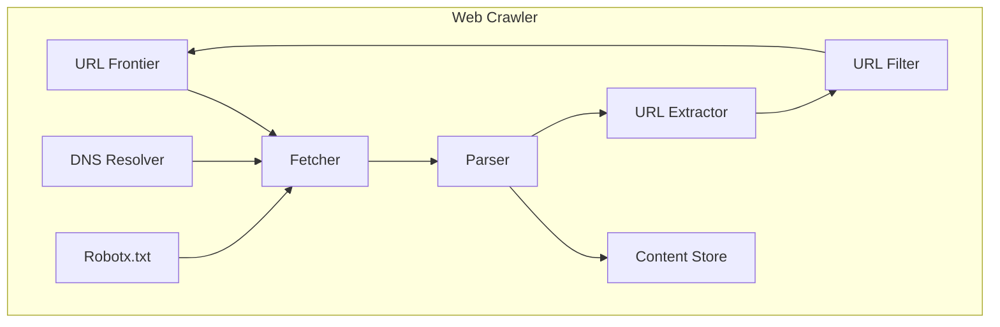
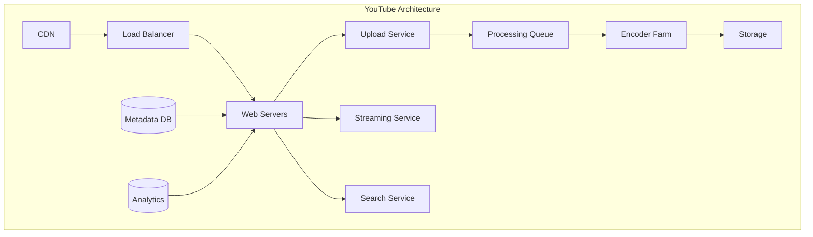
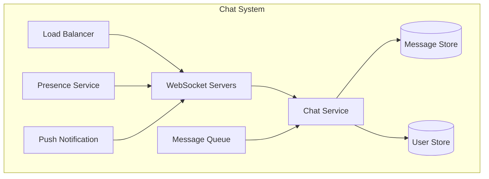
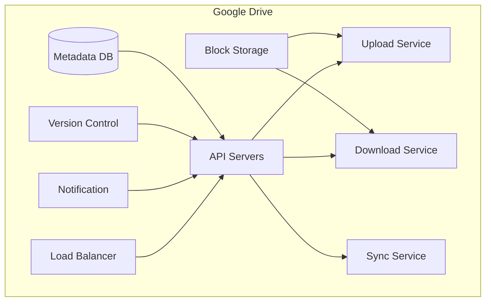
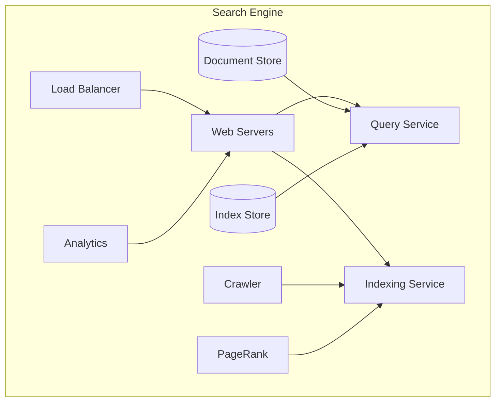

# Top 10 System Design Interview Questions and Solutions

## 1. Design a URL Shortening Service (like TinyURL)

<table>
<tr>
<td width="50%">

</td>
<td width="50%">

### Key Requirements
- Generate unique short URLs
- Redirect to original URL
- Custom short URLs
- Analytics
- High availability

### Core Components
1. Hash Generator
   - MD5 or Base62 encoding
   - Counter-based approach
2. Database Schema
   - URL mapping table
   - User info table
3. Cache Layer
   - Redis/Memcached
   - LRU eviction

### Scale Considerations
- 100M URLs/month
- 500M redirects/month
- 5 years data retention
- ~15TB storage needed

</td>
</tr>
</table>

## 2. Design Instagram

<table>
<tr>
<td width="50%">

</td>
<td width="50%">

### Core Features
- Photo/video sharing
- Social graph
- News feed
- Search functionality

### Data Storage
1. User Data: PostgreSQL
2. Media: Object Storage (S3)
3. Social Graph: Neo4j/Cassandra
4. Cache: Redis

### Scale Numbers
- 1B daily active users
- 2M photos uploaded/day
- 200M daily likes
- Feed generation for millions

### Key Challenges
- Media storage and delivery
- Feed generation
- Consistency vs Availability
- Real-time updates

</td>
</tr>
</table>

## 3. Design Twitter

<table>
<tr>
<td width="50%">

</td>
<td width="50%">

### System Requirements
- Post tweets
- Timeline generation
- Follow/unfollow
- Search functionality

### Design Decisions
1. Fan-out on write vs read
2. Cache strategy for timelines
3. Eventual consistency model
4. Partitioning strategy

### Technical Stack
- Tweets: Redis + Cassandra
- Timeline: Redis
- Search: Elasticsearch
- Media: CDN + Object Storage

### Scalability
- 300M active users
- 600 tweets/second
- 600K timeline reads/second
- Selective fan-out for celebrities

</td>
</tr>
</table>

## 4. Design a Rate Limiter

<table>
<tr>
<td width="50%">

</td>
<td width="50%">

### Algorithms
1. Token Bucket
   - Refills at fixed rate
   - Allows bursts
2. Leaky Bucket
   - Fixed processing rate
   - Queue-based
3. Fixed Window Counter
   - Simple implementation
   - Boundary issues
4. Sliding Window Log
   - More precise
   - Memory intensive

### Implementation
- Redis for distributed counting
- Local + distributed limiting
- Multiple granularities
- Rate limit headers

</td>
</tr>
</table>

## 5. Design Netflix

<table>
<tr>
<td width="50%">

</td>
<td width="50%">

### System Components
1. Content Delivery
   - Global CDN
   - Edge caching
   - Multiple bitrates
2. Microservices
   - User management
   - Content metadata
   - Recommendations
3. Data Processing
   - Video transcoding
   - Analytics
   - A/B testing

### Scale Considerations
- 200M+ users
- 15% internet bandwidth
- Petabytes of video
- Global distribution

</td>
</tr>
</table>

## 6. Design a Web Crawler

<table>
<tr>
<td width="50%">

</td>
<td width="50%">

### Core Components
1. URL Frontier
   - Prioritization
   - Politeness
2. Fetcher
   - HTTP clients
   - Rate limiting
3. Parser
   - HTML parsing
   - Content extraction
4. Storage
   - Content store
   - URL store
   - Metadata

### Considerations
- Distributed crawling
- Duplicate detection
- Fresh vs stale content
- Robots.txt compliance

</td>
</tr>
</table>

## 7. Design YouTube

<table>
<tr>
<td width="50%">

</td>
<td width="50%">

### Key Features
1. Video Upload
   - Processing pipeline
   - Multiple formats
2. Video Streaming
   - Adaptive bitrate
   - Global delivery
3. Search & Discovery
   - Metadata indexing
   - Recommendations

### Technical Challenges
- Processing at scale
- Storage management
- Real-time analytics
- Global distribution
- Copyright detection

</td>
</tr>
</table>

## 8. Design a Chat System

<table>
<tr>
<td width="50%">

</td>
<td width="50%">

### System Features
1. Real-time Messaging
   - WebSocket connections
   - Message queuing
2. Presence System
   - Online/offline status
   - Last seen
3. Group Chat
   - Message broadcasting
   - Member management

### Technical Stack
- WebSocket for real-time
- Redis for presence
- Cassandra for messages
- Push notifications

</td>
</tr>
</table>

## 9. Design Google Drive

<table>
<tr>
<td width="50%">

</td>
<td width="50%">

### Core Features
1. File Storage
   - Block-level storage
   - Deduplication
2. Synchronization
   - Delta sync
   - Conflict resolution
3. Sharing
   - Access control
   - Collaboration

### Scale Considerations
- Petabytes of storage
- Millions of updates/day
- Version history
- Global consistency

</td>
</tr>
</table>

## 10. Design a Search Engine

<table>
<tr>
<td width="50%">

</td>
<td width="50%">

### Components
1. Crawler System
   - URL discovery
   - Content fetching
2. Indexing System
   - Document processing
   - Inverted index
3. Query System
   - Query understanding
   - Ranking
   - Results serving

### Scale Requirements
- Billions of documents
- Millisecond response
- Fresh results
- Relevance ranking

</td>
</tr>
</table>

Key Notes for All Systems:
1. All designs consider:
   - Scalability
   - Availability
   - Reliability
   - Performance
   - Security

2. Common Patterns:
   - Microservices
   - Caching
   - Load balancing
   - Data partitioning
   - Message queues

3. Trade-offs:
   - Consistency vs Availability
   - Latency vs Durability
   - Complexity vs Maintainability

Would you like me to:
1. Add more detailed technical specifications?
2. Expand on any particular system?
3. Include failure handling scenarios?
4. Add capacity estimation calculations?